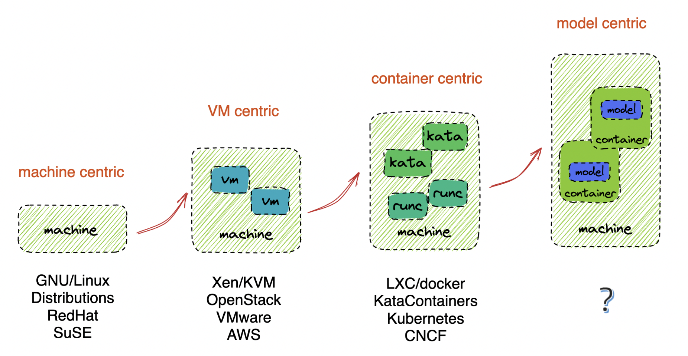

# CNAI Model Format Specification

The Cloud Native Artifacial Intelligence (CNAI) Model Specification aims to provide a standard way to package, distribute and run AI models in a cloud native environment.

## Rationale

Looking back in history, there are clear trends in the evolution of infrastructure. At first, there is the machine centric infrastructure age. GNU/Linux was born there and we saw a boom of Linux distributions then. Then comes the Virtual Machine centric infrastructure age, where we saw the rise of cloud computing and the development of virtualization technologies. The third age is the container centric infrastructure, and we saw the rise of container technologies like Docker and Kubernetes. The fourth age, which has just begun, is the AI model centric infrastructure age, where we will see a burst of technologies and projects around AI model development and deployment.

Each of the new ages has brought new technologies and new ways of thinking. The container centric infrastructure has brought us the OCI image specification, which has become the standard for packaging and distributing software. The AI model centric infrastructure will bring us new ways of packaging and distributing AI models. The model specification is an attempt to define a standard to help package, distribute and run AI models in a cloud native environment.

## Current Work

The specification, provides a compatible way to package and distribute models based on the current [OCI image specification](https://github.com/opencontainers/image-spec/) and [the artifacts guidelines](https://github.com/opencontainers/image-spec/blob/main/manifest.md#guidelines-for-artifact-usage). For compatibility reasons, it only contains part of the model metadata, and handles model artifacts as opaque binaries. However, it provides a convient way to package AI models in the container image format and can be used as [OCI volume sources](https://github.com/kubernetes/enhancements/issues/4639) in Kubernetes environments.

For details, please see [the specification](docs/spec.md).

## LICENSE

Apache 2.0 License. Please see [LICENSE](LICENSE) for more information.

## Contributing

Any feedback, suggestions, and contributions are welcome. Please feel free to open an issue or pull request.

Especially, we look forward to integrating the model specification with different model registry implementations (like [Harbor](https://goharbor.io/) and [Kubeflow model registry](https://www.kubeflow.org/docs/components/model-registry/overview/)), as well as existing model centric infrastructure projects like [Huggingface](https://huggingface.co/), [KitOps](https://kitops.ml/), [Kubeflow](https://www.kubeflow.org/), [Lepton](https://www.lepton.ai/), [ollama](https://github.com/ollama/ollama), [ORAS](https://oras.land/), and others.

Enjoy!
